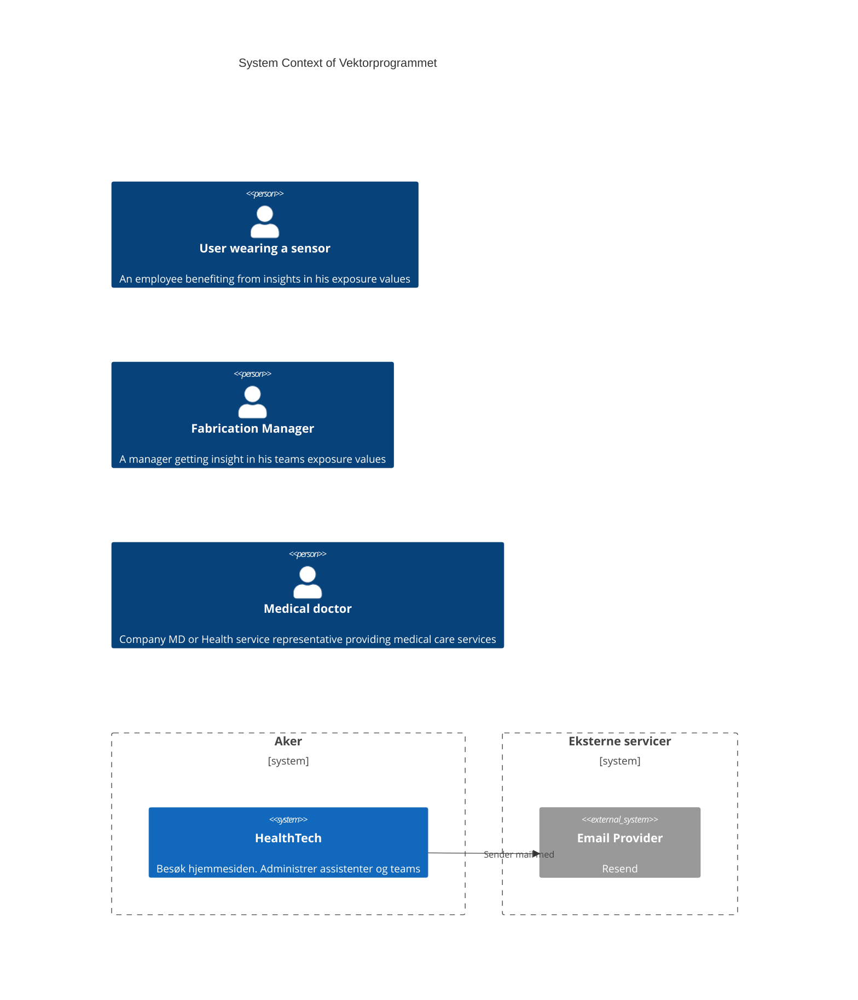
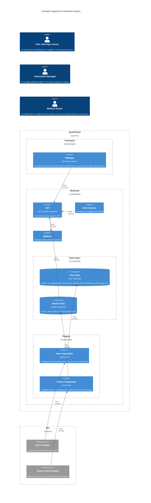

# HealthTech System architecture

## HealthTech System Context

```mermaid
C4Context
title System Context of Vektorprogrammet
    Person(user, "User wearing a sensor", "An employee benefiting from insights in his exposure values", $tags="v1.0")

    Person(manager, "Fabrication Manager", "A manager getting insight in his teams exposure values")

    Person(doctor, "Medical doctor", "Company MD or Health service representative providing medical care services")

  Boundary(aker, "Aker") {
    System(web, "HealthTech", "Besøk hjemmesiden. Administrer assistenter og teams")
  }

  Rel(web, email, "Sender mail med")

  Boundary(ext, "Eksterne servicer") {
    System_Ext(email, "Email Provider", "Resend")
  }

  UpdateLayoutConfig($c4ShapeInRow="3", $c4BoundaryInRow="2")
```

## HealthTech Container Context

```mermaid
    C4Container
    title Container diagram for HeathTech System

    Person(user, "User wearing a sensor", "An employee benefiting from insights in his exposure values", $tags="v1.0")

    Person(manager, "Fabrication Manager", "A manager getting insight in his teams exposure values")

    Person(doctor, "Medical doctor", "Company MD or Health service representative providing medical care services")

    Boundary(healthtech, "HealthTech") {
        Container_Boundary(frontend, "Frontend") {
            Container(webapp, "WebApp", "JavaScript, React", "Provides all the Internet banking functionality to customers via their web browser")
        }

        Rel(webapp, backend_api, "Uses", "HTTPS")

        Container_Boundary(backend, "Backend") {
            Container(backend_api, "API", "Java, Docker Container", "Provides functionality via API")

            Container(alert_system, "Alert System", "Alert system for notifying over exposure", $tags="v1.0")

            Container(medical_system, "Medical", "Already existing medical system")

        Rel(alert_system, backend_api, "Uses", "HTTPS")
        Rel(backend_api, medical_system, "Uses", "HTTPS")
        Rel(sensor_database, backend_api, "Uses", "HTTPS")

        Container_Boundary(database, "Data layer") {
            ContainerDb(user_database, "User Data", "SQL Database", "Stores user registration information, hashed auth credentials, access logs, etc.")

            ContainerDb(sensor_database, "Sensor Data", "NoSQL Database", "Stores sensor data from the datastream")
        }

        Rel(sensor_integration, sensor_database, "Uses", "HTTPS")
        Rel(user_integration, user_database, "Uses", "HTTPS")

        Container_Boundary(plugins, "Plugins") {
            Container(user_integration, "User Integration", "Javascript", "Integrates the incoming user data to our user formats")

            Container(sensor_integration, "Sensor Integration", "Javascript", "Integrates the incoming sensor data to our sensor formats")
        }
        }


    }

    Rel(user_provider, user_integration, "Uses", "HTTPS")
    Rel(sensordata_provider, sensor_integration, "Uses", "HTTPS")

    Boundary(external, "Ext.") {
        System_Ext(user_provider, "User Provider", "User provider from Aker Solution?")

        System_Ext(sensordata_provider, "Sensor Data Provider", "Data stream of sensor data from Aker solution")
    }

    UpdateLayoutConfig($c4ShapeInRow="3", $c4BoundaryInRow="1")
```
